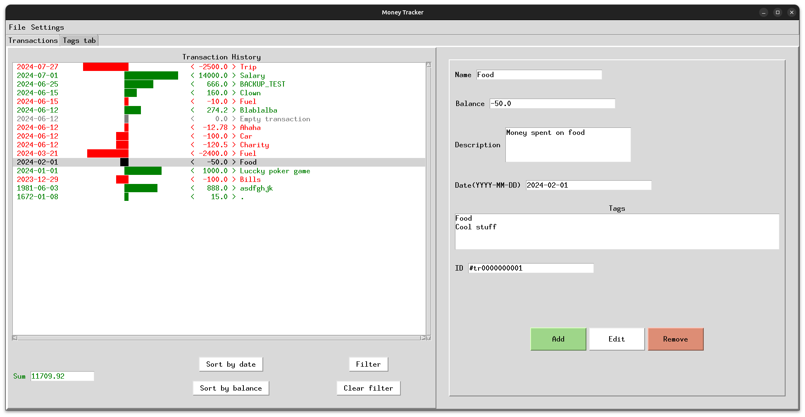
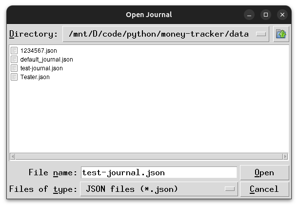
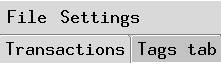
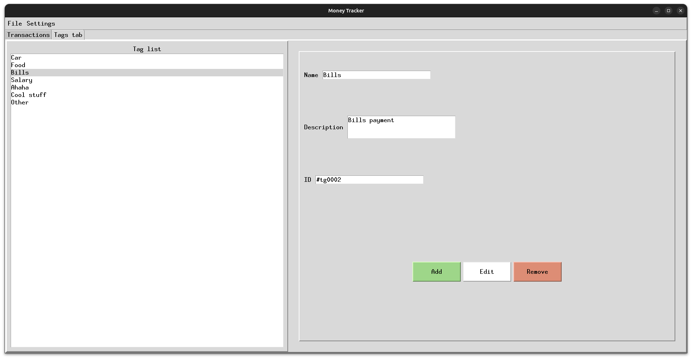
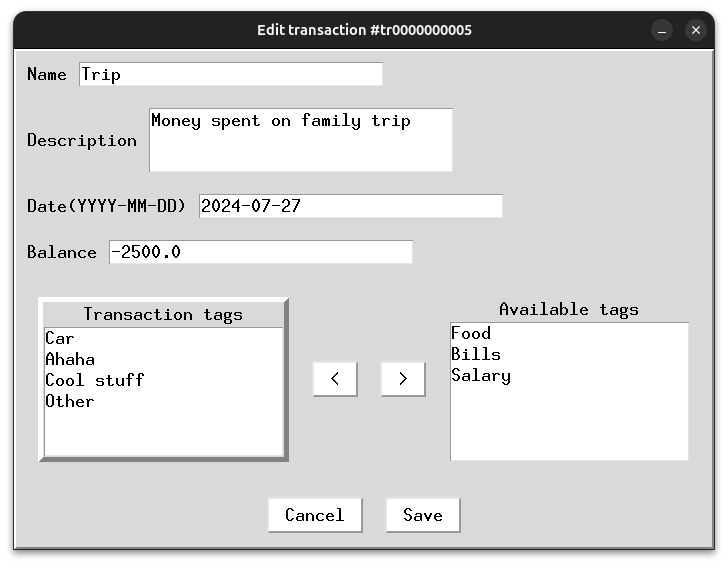
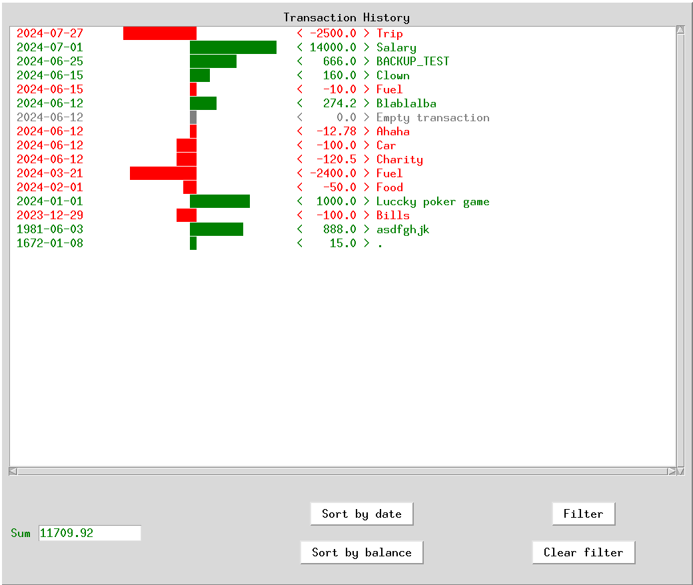
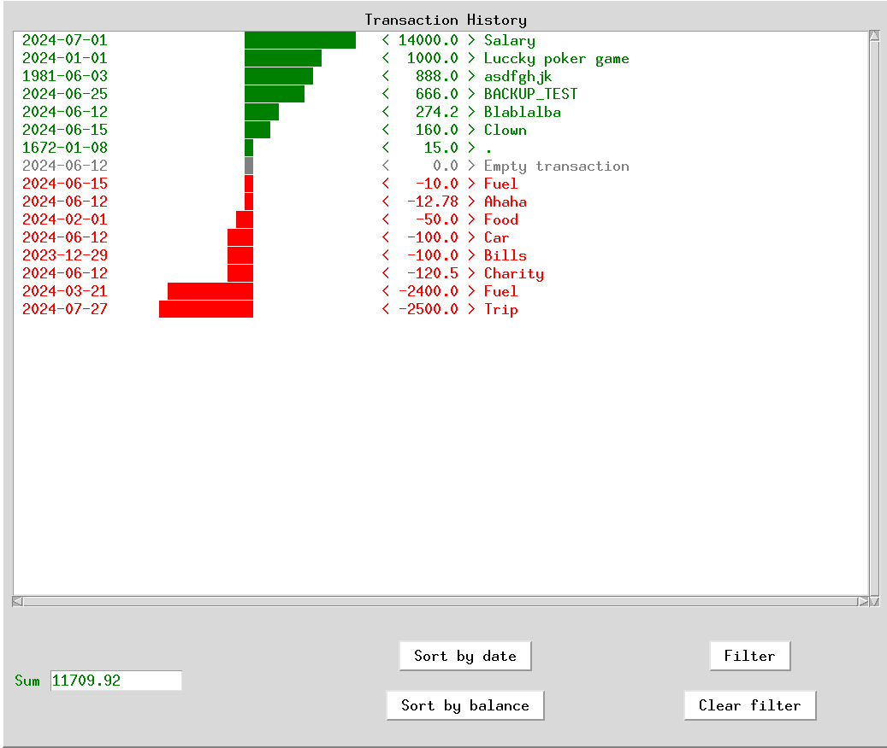
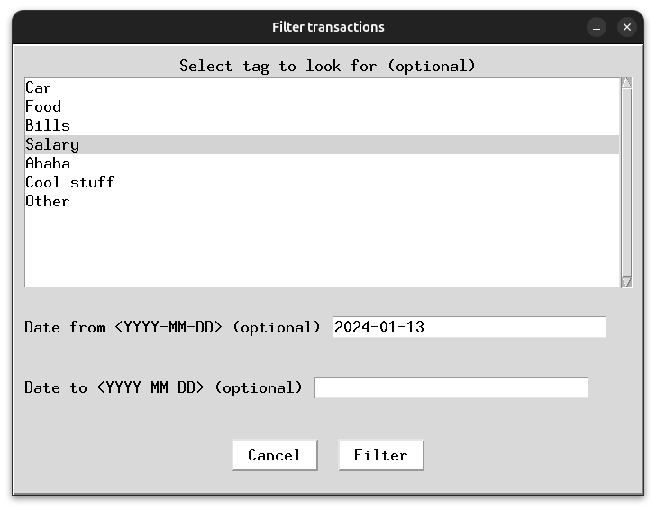
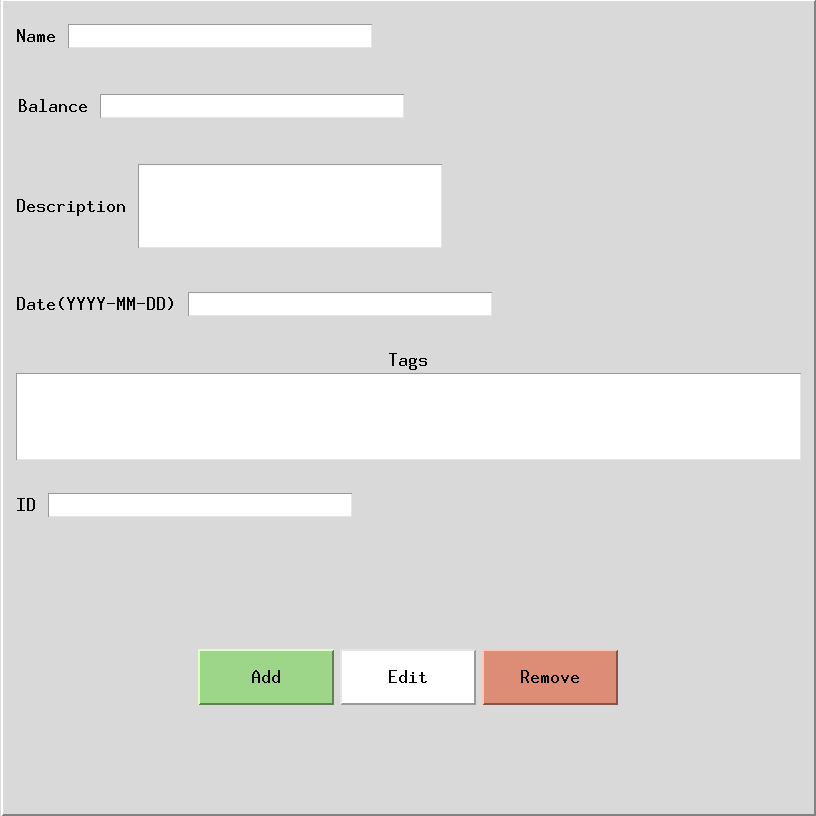
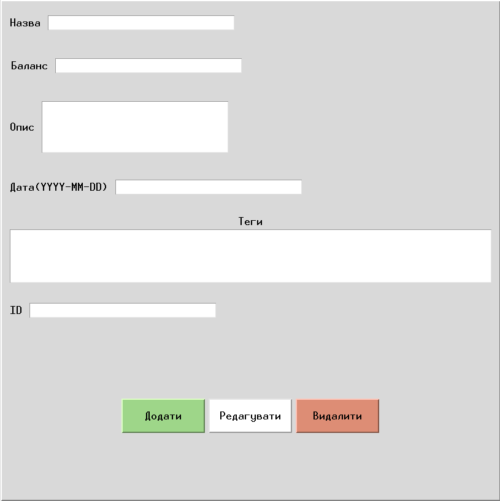

# Money tracker app


# Installation
## Requirements
> **Python and git are required to install and run application. Please ensure that they are installed on your computer.**

To run application you need tkinter that you can download by simply run
```bash
pip install tk
```


## Copying the repo
Copy git repository on your computer to desired directory

```shell
git clone https://github.com/dark-neonus/money-tracker.git
```
Enter application directory

```shell
cd money-tracker
```

## Runnings
Run application in one of next way:
1. ### Execute script `run.sh`
    - #### Linux
        ```shell
        ./run.sh
        ```
        You may encounter error like `bash: ./run.sh: Permission denied` than  you should add permission to execute this script by simple run:
        ```shell
        chmod +x ./run.sh
        ```
        And run script again
    - #### Windows
        ```powershell
        run.bat
        ```
    ___
2. ### Manually run `main.py`
    ```shell
    python main.py
    ```
    or
    ```shell
    python3 main.py
    ```
___
# Updating

___

# Features
1. ## Support for multiple Journals
    

    To create new journal or open existing one go to `File` and select `New Journal` or `Open Journal`
2. ## Recent journals feature
    

    Open `File` menu and select `Recent Journals` to see list of journals you have been opened recently

3. ## Tags for transactions support
    

    You can create, edit and remove tags that in future can be assigned to transactions 
4. ## Edit of existing transactions

    

    You can edit every existing transactions detail (*except transactions `ID`*) at any moment
5. ## Transaction sorting
    You can sort transactions in two ways:
    1. ### By date
        
    2. ### By balance
        
6. ## Filtering by tag and date
    

    You can sort transactions by one tag and/or date assigned to transaction
7. ## Two languages support
    Interface of app support two languages: `English` and `Ukrainian`, which you can switch in `Settings` -> `Language` tab
    1. ### English
        
        
        Example of gui with english interface
    2. ### Ukrainian
        

        Example of gui with ukrainina interface | Приклад вигляду програми з українським інтерфейсом

8. ## Backup machanics
    Each time apps interface is loaded backup of currently opened journal is being created at `.` -> `data` -> `backups` -> `journal_name` directory


___
# Troubleshooting
- ## Cant run app for the first time
    Check if [all required](#requirements) dependies are installed
- ## The app stopped oppening
    1. Try to delete settings file `data` -> `settings.json`
    2. Try to [update app](#updating)
    3. Try to [reinstall app](#installation)
___
# About project
I am writting small projects for few years already but i started to notice that my projects doesnt have practical usage and are created just for exercising, learning, interest or aestetic.

So i decided to change it and create project targeted on solving real problem. I wanted to start from small so just ask my mom if she have any problems that can be solved with simple script or application. She told me that she want to do some money tracking but popular apps are expensive or too feature-full ans she wants something simplier.

And after that i wrote this simple app to create journals and transaction to specially meet here needs.


